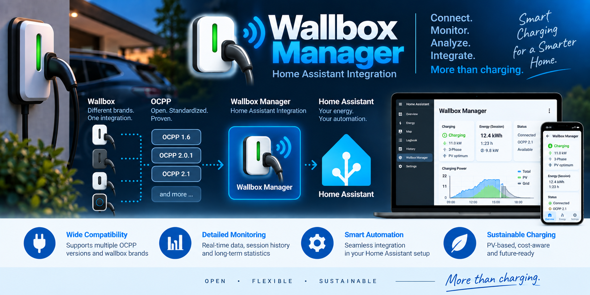

# Wallbox Manager

Wallbox Manager is a Home Assistant custom integration for managing EV charging
stations through a common, capability-based interface.

The integration is intended to work as a standalone wallbox manager while also
providing a programmatic interface for a future higher-level Energy Manager.

## Read-only integration

Version 0.1.0 is the first stable release of the read-only integration. It provides
an OCPP listener for 1.6J / 2.0.1 / 2.1, BootNotification, read-only discovery,
dynamic station devices, diagnostics, reported metering/runtime state and persistent
charging sessions.

Add this repository as a HACS custom repository of type Integration and install
Wallbox Manager once v0.1.0 is published. For manual installation, copy
`custom_components/wallbox_manager` into your HA configuration's
`custom_components` directory. Restart HA, then add Wallbox Manager under Settings
→ Devices & services and configure the bind IP and port. Configure the wallbox URL
as `ws://<HA-host>:<configured-port>/<station-id>`. Version 0.1.0 uses plain
WebSocket on a trusted local network.

Each station appears as a device with learned manufacturer, model and firmware.
Diagnostics include Connected, OCPP protocol version, Connection generation,
Boot generation, Discovery evidence and Discovery revision. Station ID and runtime
incarnation are attributes. Stations may connect after setup; reconnect updates
the same entities. On disconnect Connected becomes false, metadata and last-known
protocol/counters remain, and discovery evidence is invalidated. After integration
reload known devices remain: Connected is false and other diagnostics are
unavailable until a new connection supplies a snapshot.

Reported voltage/current/power per phase, explicit total import power and imported
energy now create scoped HA sensors dynamically. Connector state and Charging
state enums are the canonical operational state entities, preserving connected,
charging and paused/suspended states without redundant boolean projections.
Known meter values, including unchanged zero values, remain available while the
connection is live. Missing/invalid data and boot/disconnect make operational
entities unavailable while retaining IDs. The 120-second sample deadline remains
for conservative session attribution and endpoint accounting, not ordinary HA
meter availability.
See [metering and runtime state](docs/metering-runtime-state.md) for scope, units,
capability-driven entity creation, freshness and deliberately unsupported cases.

Transaction lifecycle events now create exactly nine current-or-last session
entities (without a separate Session Charging State entity) per
observed EVSE/connector. Completed values stay visible until the next session;
energy uses matching meter-register deltas. A sole connector session may use fresh
parent-EVSE total power/energy; ambiguous multi-session attribution stays unknown.
TransactionEvent samples feed sessions without creating duplicate ordinary meter
entities. Existing beta.5 duplicates and beta.6 removed boolean/session-state entities may
remain in HA's registry for manual cleanup; no automatic deletion is performed.
Active sessions and all completed
history survive reload/restart. Disconnect and boot do not end a session. See
[session tracking and persistence](docs/session-tracking.md) for lifecycle,
accounting, restoration, query access and limitations.

OCPP 2.1 transaction-scoped charging OperatingPoint dispatch is implemented for
explicitly bound EVSEs with verified device capabilities. One immediate TxProfile
sets current and phase count together. Current bounds and resolution come from the
EVSE's verified ChargingEnvelope; representable fractional currents are supported.
Canonical phase counts identify EVSE-local modes; any required phase transition
still needs separate verified operation evidence. `numberPhases` alone does not
prove switching support. Fixed-phase devices can use their verified fixed mode.

## Manual charging control (v0.2.x development)

Known OCPP 2.1 connectors receive seven stable Home Assistant controls, named
`EVSE N / M`: desired charging power, allowed current 1p/2p/3p, charging enabled,
power approximation (DOWN/NEAREST/UP), and maximum deviation without phase
switching (0–25%, default 5%). Desired values survive offline periods and reloads.
Restoration, telemetry and reconnects never dispatch commands. Explicit edits can
dispatch only while remote authority is confirmed.
Missing allowed-current controls initialize once from verified connector maxima:
the matching phase-specific maximum, then a generic maximum, then the highest
known phase-specific maximum. Thus 20 A (1p) / 27 A (3p) initializes 20 / 27 / 27 A
without creating 2p support. Existing saved values (including zero), live edits
and already initialized values survive later capability changes and reconnects.
Discovery may initialize them after startup; initialization never sends commands.
HA restoration retains exact fractions alongside the displayed numeric state.
Without trustworthy maxima, controls remain unset and impose no additional limit.
Current limits accept
non-negative fractions, including values above the device maximum and values for
unsupported modes. Zero inhibits only that mode. They never establish capability.

### Capabilities and reference fallback

Each normalized capability is resolved independently: a verified current-generation
OCPP observation wins; otherwise an explicitly configured operator reference fills
that field; otherwise it remains unknown. Explicit unsupported or malformed OCPP
observations fail closed and cannot be overridden by reference values. A reference
maximum never adds a phase count excluded by the station. The solver intersects
resolved capability envelopes with desired current limits using exact fractions;
reachable points remain on the device's minimum-plus-step grid.

Completed accepted OCPP 2.1 FullInventory reports recognize the descriptive
extensions `SupportedPhaseModes`, `MinimumCurrent`, `CurrentStep` and
`PhaseSwitchingSupported` on EVSE components, and `MaximumCurrent1Phase`,
`MaximumCurrent2Phase`, `MaximumCurrent3Phase`, `ChargingEnableDisableSupported`
on explicitly scoped Connector components. The implementation-defined connector
extension `MaximumCurrent` (amperes) is also recognized for generic current-limit
facts, with the same complete-inventory, scope and validation requirements. It is
not an alias for arbitrary similarly named variables or evidence of any supported
phase count, conductor mapping or switching support; it never creates an envelope.
These extensions are not universal
OCA variables. SmartChargingCtrlr/Available remains advertisement only.
Reconnection and BootNotification invalidate discovered evidence and rediscover it.

Read-only capability sensors use EVSE scope for supported phases, minimum and
step, and connector scope for maxima and enable/disable support. Missing or
unsupported maxima do not create sensors (in particular no invented 2p maximum).
Existing entity identities remain in the registry offline. Diagnostic source and
evidence attributes distinguish OCPP observations from configured operator fallback.

Configure fallback fields individually in integration options, associated with
explicit station/EVSE/connector IDs. No vendor, model, firmware, serial or global
verification checkbox is required. Decimal and fractional currents are accepted.
References never override verified wallbox values. Normal current limits belong
to the runtime controls, not the reference form.

Supported phase counts construct canonical **EVSE-local** modes: 1p = L1,
2p = L1+L2, 3p = L1+L2+L3. These labels do not identify the equally named
building/grid conductors. No separate conductor-mapping extension or reference
mapping is required. Existing reference options remain readable; the resolver
uses canonical modes. The core can still represent arbitrary subsets for other
adapters. Each mode requires fresh, positive voltage observations on all its local
phases. Missing L2/L3 excludes affected modes while a valid L1 still permits 1p.
Telemetry alone never dispatches; a new explicit control action recalculates.

### Explicit control authority

Authority is observed separately from desired charging permission: `unknown`,
`local`, or `remote`. Normal control edits persist intent but cannot acquire
authority. Actual power and permission dispatch requires confirmed remote authority;
otherwise diagnostics report `no_authority`.

Stations exposing the implementation-defined, station-scoped
`WallboxController.ControlAuthority` gain one enum sensor **Control authority**
(**Steuerungsautorität**) and one button **Take control** (**Steuerung übernehmen**).
Their stable unique IDs are `<entry>:<station>:control_authority` and
`<entry>:<station>:take_control`. They are not duplicated per connector. There is
no authority switch or return-control action; return to local operation in the
wallbox's own web UI.

The OCPP 2.1 adapter discovers the exact writable Actual variable, sends
SetVariables with `OCPP`, requires a matching Accepted response, and then confirms
Actual `OCPP` with GetVariables. `Local` means local control; other values remain
unknown. This descriptive extension is not a universal standardized OCPP variable.
After confirmation, the explicit action applies stored manual intent once: enabled
positive power installs the solved profile before enabling permission; disabled
intent sends disable without starting charging. Desired values do not change.
The button result reports acquisition; connector diagnostics report application,
which can still be blocked by missing transaction, voltage or capability evidence.

Connection/boot generations, newer edits, concurrent takeover requests and local
loss events fence queued work and late results. Discovery/telemetry/reconnects never
automatically apply intent or retry takeover. Authority is valid within the current
connection, using the inspected station's hard-wired local-loss NotifyEvent path;
this assumes timely delivery of those events, not a remote ownership lease. A
command already sent cannot be recalled. `wallbox-stationary` already supplies the
read/write/readback and local-loss interface and needs no change. Hardware validation
remains outstanding. Future profile selection can explicitly reuse the generic
`take_control` operation instead of hiding takeover in ordinary edits.

### Physical feedback and phase retention

Fresh standard NotifyEvent `Connector.PhaseRotation`, with explicit EVSE and
connector identity, maps `Rxx` to L1 and `RST` to L1/L2/L3. Unknown values invalidate
that connector's physical mode. Reports expire after five seconds, are ordered by
timestamp, and are fenced by connection/boot generation. There is no vendor or
reference identity gate. Feedback proves position, not switching capability.
Profiles, desired state and measured currents cannot prove physical phase position.

Retention applies only to an active positive charging operating point. Disabled,
zero-current or unconfirmed/inactive charging selects the globally best valid
initial mode. Re-enabling explicitly bypasses retention from the idle relay
position. The deviation is `abs(reachable - target) / target * 100`, evaluated only
for positive targets after directional and electrical constraints. DOWN never
exceeds the target; UP never undershoots it. There is no dwell timer.

### Charging permission

Charging enabled is desired permission, independent of capability and observed
charging state. Explicit disable uses the protocol-neutral permission operation,
implemented through OCPP 2.1 SetVariables on a discovered writable
`WallboxController.ChargingEnabled`. Exact connector scope is preferred; a
station-scoped endpoint is usable only for a station with exactly one known
connector. A matching accepted result is required. Missing capability or writable
endpoint fails closed. Desired watts remain stored while disabled.

Enabling with a positive target first installs a valid transaction charging profile,
then grants permission. Both operations use generation/intent fences, including
checks after queue waits. There is no automatic retry or resume. APPLIED means
protocol acceptance, not proof of energy flow. Disable is never implemented as a
zero-ampere profile. Zero-power pause execution remains unsupported and fails
closed; it does not grant permission or silently substitute a positive target.
OCPP 1.6/2.0.1 charging control, Energy Manager strategies and EV learning remain
future work. Hardware behavior requires testing with the actual station.

## Architecture

See the [proposed architecture](docs/architecture.md) and the
[pinned upstream OCPP adoption analysis](docs/upstream-ocpp-analysis.md) for module
boundaries, ownership transitions, power solving and reuse decisions. These are
design documents; the implemented subset now includes pure solving, a
protocol-independent control command boundary and read-only OCPP
transport/discovery, metering/runtime state and session tracking/persistence.
The command boundary forwards resolved operating points to the OCPP 2.1 adapter
and normalizes its outcomes; acceptance does not confirm measured power.

Wallbox Manager separates charging strategy from wallbox-specific communication.

~~~text
Optional Energy Manager
        |
        | target charging power
        v
Wallbox Manager
        |
        | profiles, control logic and capability model
        v
Protocol adapters
        |
        +-- OCPP 1.6J
        +-- OCPP 2.0.1
        +-- OCPP 2.1
        +-- future protocol adapters
        |
        v
Wallbox
~~~

Standard OCPP functionality is preferred whenever possible. Vendor-specific
functionality may be implemented through isolated OCPP DataTransfer extensions.

## Planned charging profiles and control ownership

The planned user-selectable Wallbox Manager profiles are:

- OFF
- PV_SURPLUS
- PV_OPTIMUM
- PV_MAXIMUM
- GRID

The PV profiles work standalone using configured, vendor-neutral HA sensors:
separate non-negative grid import/export and battery charge/discharge power in W,
battery SOC and observed reserve in %, plus remaining-current-day PV forecast in
kWh for PV_OPTIMUM. Signed vendor readings can be split with HA template/helper
sensors; Wallbox Manager does not write inverter registers.

- PV_SURPLUS preserves a configurable high battery SOC while using current surplus.
- PV_OPTIMUM has separate daytime minimum and evening battery SOC targets, with
  a configured average household consumption in W, battery capacity in kWh and
  forecast/safety reserve in kWh. The forecast means total PV generation remaining
  today, before household consumption. Predicted household energy shortfall until
  sunset is converted to additional SOC above the evening target, clamped between
  minimum SOC and 100%. HA supplies today’s sunset; after sunset the remaining
  duration and forecast contribution are zero, without planning against tomorrow.
- PV_MAXIMUM maximizes PV plus permitted battery contribution using its own minimum
  SOC, independent of PV_OPTIMUM.

Known battery reserves take precedence over lower profile minima. If expected
battery discharge becomes unavailable while grid import persists, flow-based
fallback reduces charging toward PV-only surplus. Small grid-import tolerance
covers control resolution and latency; it is not an intentional charging budget.
Missing/stale required inputs inhibit the dependent profile.

Two additional states represent control ownership and cannot be selected as
normal Wallbox Manager profiles:

- LOCAL: control was taken locally at the wallbox.
- REMOTE: control was explicitly granted to an external Energy Manager.

Selecting a normal Wallbox Manager profile is an explicit user action and may
therefore acquire remote/OCPP authority from the wallbox. A fresh explicit “Take
control” action in Energy Manager can also directly leave LOCAL and acquire REMOTE
through a trusted HA/Wallbox Manager user-action mechanism; selecting a normal
profile first is not required. Keep LOCAL latched until device authority is verified.
Failure leaves LOCAL with no usable lease or background retry. On success, create
a fresh lease and require a fresh target before REMOTE becomes ACTIVE.

If the wallbox is switched to local control, Wallbox Manager must not
automatically reacquire remote authority.

REMOTE control uses an owner-specific runtime lease and heartbeat. Technical
interruptions preserve the desired profile and existing owner authorization. After
reconciliation, normal profiles resume automatically; REMOTE requires an
authenticated recovery handshake, a fresh lease and a fresh target, without another
user click. A deliberate LOCAL takeover blocks automatic recovery and requires
a new explicit user action to leave LOCAL. Ordinary API calls, heartbeats and
recovery handshakes cannot assert that authorization or bypass the LOCAL latch.

## Planned Energy Manager interface

A future Energy Manager communicates with Wallbox Manager through a programmatic
API rather than by manipulating Home Assistant entities.

The Energy Manager requests charging intent, for example target power and a
rounding direction. Wallbox Manager translates that request into a valid
wallbox operating point according to the wallbox capabilities.

The implemented pure solver supports these target-power directions:

- DOWN
- NEAREST
- UP

Standalone profiles handle simple current-day PV logic and energy-flow feedback.
Advanced forecasts, prices, departure/vehicle targets, learned behavior and site-wide
optimization belong to the future Energy Manager, which supplies current power
intent through REMOTE. Wallbox Manager retains technical operating-point solving.

Home Assistant entities remain available for user interaction, display and
automations.

## Development status

Version 0.1.0 establishes the stable read-only scope described above. Development
now includes the first v0.2.x manual HA control path through the OCPP 2.1 adapter.
Charging profiles and the planned Energy Manager interface remain future work.

Immutable station/EVSE/connector identities, capability evidence and independent
phase envelopes, voltage observations, power requests and solver results are
implemented. The pure solver respects current steps and supplied electrical limits,
uses actual per-phase voltages, and returns an offered operating point, logical OFF
or an explicit unreachable reason. A deferred-result contract is reserved for the
future phase-transition planner. It does not command a charger or claim measured
EV consumption. Metering and runtime state are reported separately by adapters.
Ownership and charging profiles remain future work.

Run development checks with `.venv/bin/ruff check .`,
`.venv/bin/ruff format --check .` and `.venv/bin/pytest`. Core tests require no running
Home Assistant instance; Python 3.14 CI runs these same checks.

## Read-only OCPP endpoint

Configure Wallbox Manager with a local bind IP and port (defaults `0.0.0.0:9000`).
Point the wallbox at `ws://<HA-host>:<port>/<station-id>` and explicitly select
OCPP 1.6J, 2.0.1 or 2.1. Multiple stations can connect to one endpoint. Missing or
unsupported subprotocols are rejected. No station ID, vendor or current limit is
hard-coded. The endpoint currently uses plain WebSocket without station
authentication or TLS, for a trusted local network only.

The integration loads without a connected wallbox. It accepts BootNotification,
answers Heartbeat, learns identity/connector inventory, and reruns read-only
discovery after reconnect/boot. Disconnect invalidates old evidence without
requiring an integration reload. StatusNotification supplies scoped operational
state and identity. OCPP 1.6 uses GetConfiguration; 2.x uses correlated, complete
GetBaseReport/NotifyReport inventory. All three versions use their own schemas
from `ocpp==2.1.0`; this is a tested foundation, not a full protocol implementation.

Smart-charging advertisements remain distinct from verified behavior. Physical
current envelopes, physical phase switching and stop support stay unknown; no
nominal current/phase limits are invented. Generic immutable runtime snapshots are
consumed by push-based HA diagnostics and observed meter/state entities. Manual
intent controls are exposed for known OCPP 2.1 connectors. Hardware validation with wallbox-stationary has
confirmed capability-driven metering entities, connection-generation/liveness
handling, session tracking and persistence, and session meter attribution. An
actual network black-hole/DROP test confirmed OCPP reconnect, preservation of an
active charging session, and recovery of connector state and meter values after
reconnect. This validation complements the automated fake/local-peer tests; it
does not establish full protocol conformance or compatibility with every wallbox.
Older empty scaffold entries migrate to the default endpoint configuration.

## Upstream code and attribution

The project may reuse or adapt MIT-licensed code from other open-source
projects, including OCPP implementations.

Any code that is copied or substantially adapted will retain the required
copyright and license notices and will be documented appropriately.

Selected transport, lifecycle, boot and discovery code/scenarios are now adapted
from the pinned upstream. See the [adoption record](docs/upstream-ocpp-analysis.md)
and [MIT notices](custom_components/wallbox_manager/THIRD_PARTY_NOTICES.md).

## License

Wallbox Manager is licensed under the MIT License. See `LICENSE`.
